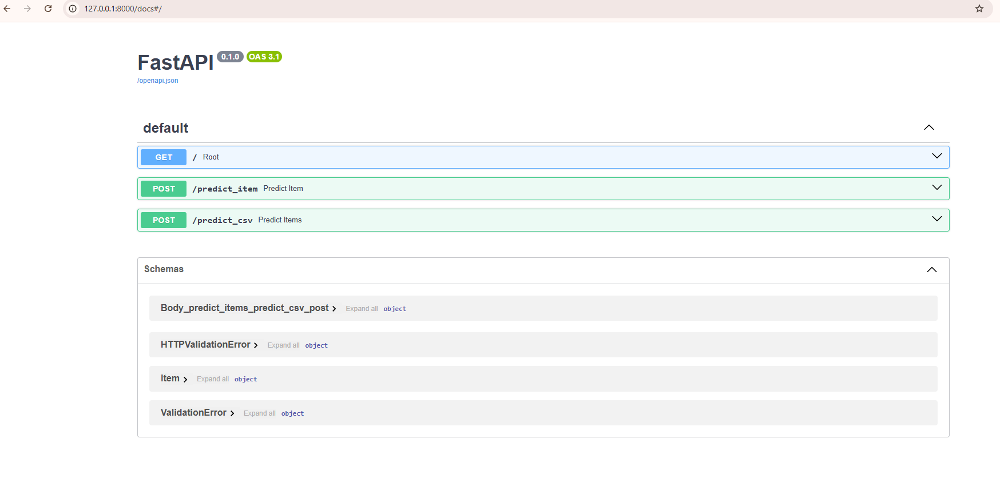

# Краткое резюме о проделанное работе
## EDA и визуализация
- первым делом были удалены дубликаты в тренировочном датасете
- приведены к числовому типу признаки mileage, engine, max_power в тренировочном и тестовом датасетах, пропущенные значения заполнены медианой
- после построения графиков были выявлены линейные зависимости целевой переменной(цена) с мощностью двигателя, его объемом(положительная корреляция) и пробегом автомобиля(отрицательная корреляция). Так же есть корреляция признаков:отрицательная между годом выпуска и пробегом(чем новее авто тем меньше его пробег) и мощностью двигателя и объемом(чем мощнее двигатель тем больше в нем литров)
- в качестве бонуса я построила 2 графика, на первом отражена средняя цена автомобиля в зависимости от типа трансмиссии( автомобили на автомате в среднем гораздо дороже машин на механике). На втором средняя цена машины в зависимости от количества владельцев(чем меньше было владельцев тем цена выше, а у авто с тест драйва средняя цена сильно выше остальных(предположу что там авто элитных марок). Так же в качестве бонуса построила дашборды.
## Построение моделей
- первая модель классической линейной регресии была построена только на вещественных признаках, качество ее было не очень хорошим(как и ожидалось)
- далее была применена стандартизация, но качество модели лучше не стало
- попытка применить регуляризацию с помощью Lasso-регрессии так же не привело к улучшению качества
- попробовали ElasticNet регрессию, так же без положительного эффекта
- добавили категориальные фичи. В столбце name я оставила 2 первых слова(по сути это название модели, тк дальше идут описания трансмиссий, литража, дополнительных функций и т.п.) и закодировала его mean target encoderом.  Признаки fuel, seller_type, transmission, owner и seats ,были закодированы с помощью one hot encoderа.
- построила модель Ridge и получила небольшое увеличение качества прогнозов.
## Бизнесовая часть
- посчитала долю прогнозов, отличающихся от реальных цен на эти авто не более чем на 10% (в одну или другую сторону). Задачу бизнеса лучше всего решила модель ElasticNet
## Реализация сервиса на FastAPI
- для этого была выбрана модель Lasso

- на вход принимаются признаки 1-го объекта. На картинке ниже пример запроса

Ответ: число типа float(предсказанная цена)

- на вход подается файл csv, на выходе так же csv файл с +1 столбцом(предсказанная цена)

- В качестве файла я загружала [тестовый датафрейм](screenshots/car.csv) сохраненный в csv
- На выходе получила этот [файл](screenshots/prediction_price_full.csv)
